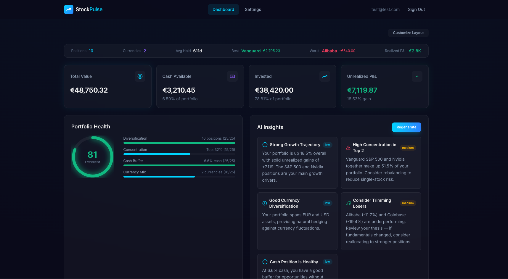
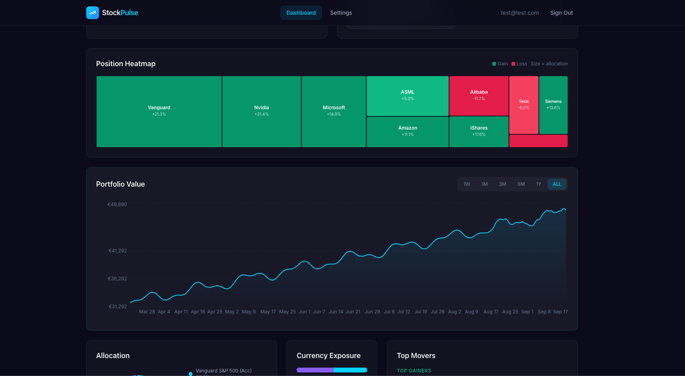
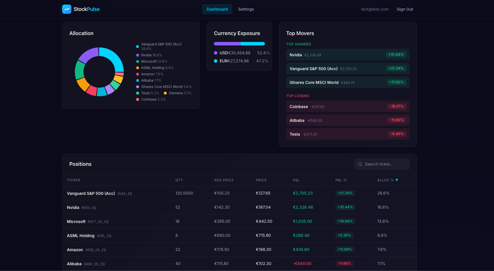
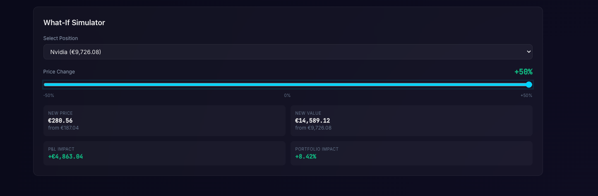

# StockPulse

A self-hosted, AI-powered portfolio tracker for [Trading 212](https://www.trading212.com). Connect your account, track performance over time, and get AI-generated insights about your portfolio.

> **Disclaimer:** This project is not affiliated with, endorsed by, or connected to Trading 212 UK Ltd.

> **Note:** All screenshots below use demo data with fictional portfolio values for illustration purposes.



## Features

**Portfolio Dashboard**
- Real-time portfolio summary (total value, cash, invested, unrealized P&L)
- Stats ribbon with key metrics at a glance
- Portfolio health score with diversification, concentration, and cash analysis
- Drag-and-drop customizable layout — reorder sections however you want

**Visualizations**
- Position heatmap — treemap colored by P&L, sized by allocation
- Historical portfolio value chart with time range selector (1W to ALL)
- Allocation donut chart, currency exposure breakdown, top movers





**What-If Simulator**
- Select any position, drag the price change slider (-50% to +50%)
- Instantly see the impact on position value and total portfolio



**AI Insights**
- Connects to [LLM Gateway](https://github.com/NourAldeenKassar/llm-gateway) for AI-powered portfolio analysis
- Generates actionable insights: concentration warnings, diversification suggestions, P&L observations
- Insights are saved to DB — loads instantly on next visit, regenerate on demand
- LLM Gateway is configured per-user in Settings (not a server requirement)

**Data Collection**
- Configurable snapshot frequency per account (hourly to daily)
- Automatic cron job stores portfolio snapshots for historical charts
- Encrypted API credential storage (AES-256-GCM)

**Multi-User**
- Email + password authentication with JWT
- Each user connects their own Trading 212 API key
- Users only see their own data

## Tech Stack

| Layer | Technology |
|-------|-----------|
| Backend | NestJS 11, TypeScript |
| Database | PostgreSQL, Prisma 6 |
| Frontend | Next.js 15, React 19, Tailwind CSS 4 |
| Charts | Recharts (area, pie, treemap) |
| Drag & Drop | dnd-kit |
| Auth | JWT (access + refresh tokens), bcrypt |
| Encryption | AES-256-GCM (Node.js crypto) |
| Scheduling | @nestjs/schedule (cron) |
| Deployment | Docker, Nginx reverse proxy |

## Quick Start

### Prerequisites

- Node.js 22+
- PostgreSQL 16+
- A [Trading 212](https://www.trading212.com) Invest account with API access

### Setup

```bash
git clone https://github.com/NourAldeenKassar/stockpulse.git
cd stockpulse

# Install dependencies
npm install
cd frontend && npm install && cd ..

# Configure environment
cp .env.example .env
# Edit .env with your database URL, JWT secrets, and encryption key

# Run database migrations
npx prisma migrate deploy

# Start development
npm run dev
```

Open `http://localhost:3001`, create an account, then connect your Trading 212 API key in Settings.

### Docker

```bash
docker compose up -d
```

This starts PostgreSQL and the app on port `3000`.

## Environment Variables

| Variable | Required | Description |
|----------|----------|-------------|
| `DATABASE_URL` | Yes | PostgreSQL connection string |
| `JWT_SECRET` | Yes | Secret for access token signing |
| `JWT_REFRESH_SECRET` | Yes | Secret for refresh token signing |
| `ENCRYPTION_KEY` | Yes | 64-char hex string for AES-256 encryption |
| `TRADING212_BASE_URL` | No | Defaults to `https://live.trading212.com` |

AI insights are configured per-user in the Settings UI (not via environment variables).

## Project Structure

```
stockpulse/
  src/
    auth/           # JWT authentication + guards
    account/        # Trading 212 account management
    trading212/     # API client with rate limiting
    snapshot/       # Scheduled portfolio snapshots
    insight/        # AI insight generation + storage
    llm/            # LLM Gateway client
    crypto/         # AES-256-GCM encryption service
    prisma/         # Database module
  frontend/
    app/            # Next.js pages (dashboard, settings, auth)
    components/     # React components (charts, tables, cards)
    lib/            # API client, auth context, shared utils
  prisma/
    schema.prisma   # Database schema
```

## License

MIT
